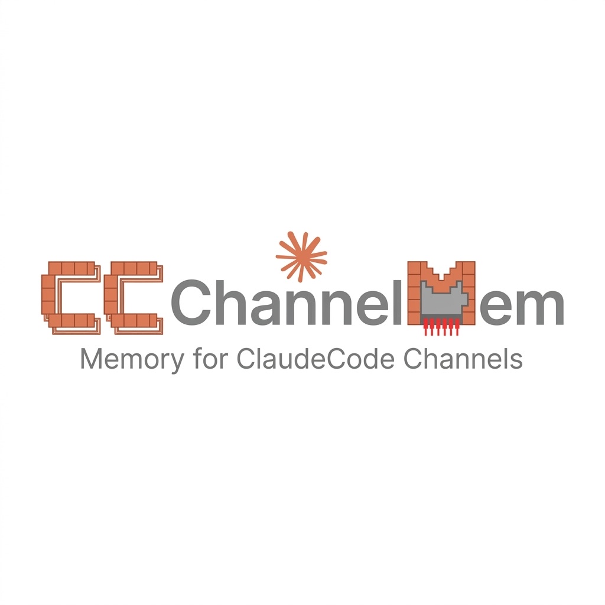

# cc-channel-mem

<p align="center">
  
</p>

Discord/Telegram 서버 채널의 대화를 Claude Code 세션과 독립적으로 로컬에 영구 저장하고,
다음 Claude Code 세션 시작 시 관련 메모리를 자동 주입하는 MCP 서버 + 백그라운드 데몬.

## 핵심 원칙

- **수신 즉시 저장** — 세션 종료 이벤트에 의존하지 않음. 데몬이 살아있으면 무조건 저장.
- **무손실 저장** — AI 판단 없이 모든 메시지를 원본 그대로 저장.
- **봇 B 전용** — 서버 채널 메시지 저장만. 응답 없음.

## 설치

```bash
npm install -g cc-channel-mem
# 또는 로컬 경로로 직접 사용
```

## 빠른 시작

### 1. 봇 설정

```bash
cc-channel-mem setup
```

Discord Bot Token, Telegram Bot Token 입력 → `~/.cc-channel-mem/.env` 생성

**Discord 봇 설정 시 Developer Portal에서 반드시 활성화:**
- `Message Content Intent`

### 2. 데몬 시작

```bash
cc-channel-mem start
cc-channel-mem status
```

### 3. MCP 서버 등록

```bash
claude mcp add cc-channel-mem -- node /path/to/cc-channel-mem/src/mcp/index.js
```

### 4. SessionStart Hook 등록 (선택, 자동 메모리 주입)

`~/.claude/settings.json` 에 추가:

```json
{
  "hooks": {
    "SessionStart": [{
      "matcher": "",
      "hooks": [{
        "type": "command",
        "command": "/path/to/cc-channel-mem/hooks/session-start.sh"
      }]
    }],
    "PreCompact": [{
      "matcher": "",
      "hooks": [{
        "type": "command",
        "command": "/path/to/cc-channel-mem/hooks/pre-compact.sh"
      }]
    }]
  }
}
```

## CLI 명령

```
cc-channel-mem start    데몬 백그라운드 실행
cc-channel-mem stop     데몬 종료
cc-channel-mem status   실행 여부 + 저장된 메시지 수 + 마지막 수신 시각
cc-channel-mem setup    .env 파일 대화형 생성
cc-channel-mem logs     오늘 일일 로그 출력
```

## MCP 도구

| 도구 | 설명 |
|------|------|
| `mem_search(query, limit?)` | 하이브리드 검색 (FTS5 + 벡터) |
| `mem_read(date?, platform?)` | 일일 로그 읽기 |
| `mem_status()` | 데몬 상태 + 통계 |
| `mem_inject(query?)` | SessionStart 컨텍스트 주입용 요약 |

## 데이터 위치

```
~/.cc-channel-mem/
├── .env              봇 토큰 (chmod 600)
├── MEMORY.md         장기 큐레이션 메모리
├── memory/
│   └── YYYY-MM-DD.md 일일 로그
├── main.sqlite       FTS5 + 벡터 인덱스
└── daemon.pid        데몬 PID
```

## 메모리 포맷

```
## HH:MM [Discord — #dev-channel] @Alex
메시지 원본 내용
S @Alex: 요약 (50자)
```

## 검색 아키텍처

```
쿼리
 ├── FTS5 BM25 키워드 검색 (40%)
 └── 벡터 코사인 유사도 (60%)
      ├── Ollama nomic-embed-text (로컬, 우선)
      └── Voyage-3 via Anthropic SDK (폴백)
```

## 환경 변수 (.env)

```
DISCORD_BOT_TOKEN=
DISCORD_ALLOWED_GUILD_IDS=      # 빈 값 = 전체 서버 허용
DISCORD_ALLOWED_CHANNEL_IDS=    # 빈 값 = 허용 서버 전체 채널
TELEGRAM_BOT_TOKEN=
TELEGRAM_ALLOWED_CHAT_IDS=      # 빈 값 = 전체 허용
ANTHROPIC_API_KEY=               # curator.js Claude 큐레이션 (선택)
```

## 기술 스택

- Node.js 20+, discord.js v14, node-telegram-bot-api
- better-sqlite3 + FTS5, chokidar
- @modelcontextprotocol/sdk

## Contributors

- **[Alex Lee](https://github.com/AlexAI-MCP)** — 기획, 설계, 아키텍처
- **Claude Code (Anthropic)** — 구현, 오토리서치, 최적화
- **Agent Forge** — 에이전트 프레임워크
- **OpenCrab** — MetaOntology MCP 서버
